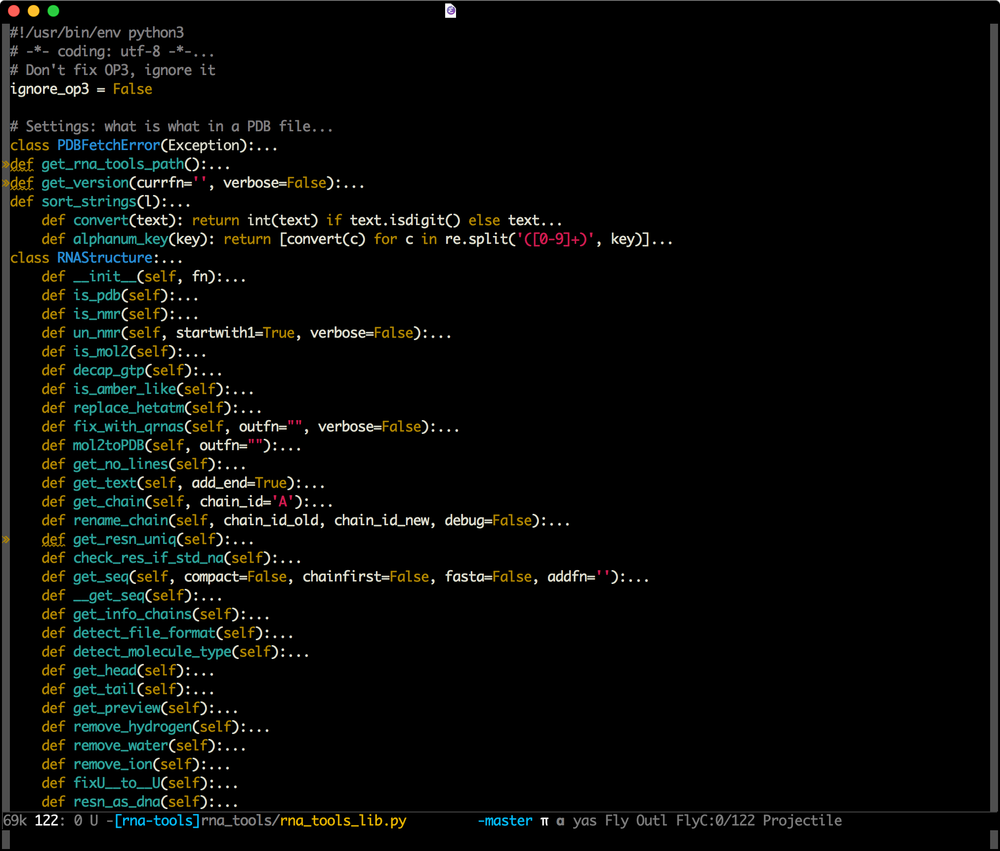
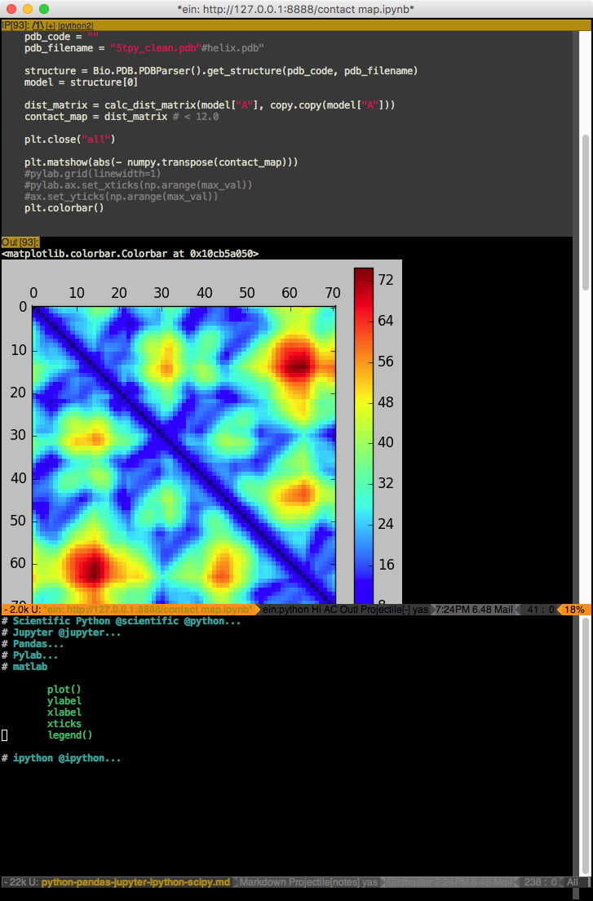
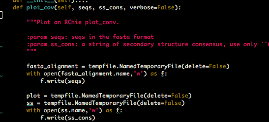

# Magnus' Emacs Env

Fig. Python Mode (python-outline - old)

Fig. Geekbook (Markdown) + Jupyter (IPython notebook)

I've been using Emacs for over 10 years now. This's my config file :-) it might be useful for someone.

I'm using:

- `OrgMode` <http://orgmode.org/>
- Python:
  - ``python-mode.el`` <https://www.emacswiki.org/emacs/ProgrammingWithPythonModeDotEl>

            
        
  - ``flycheck`` (including ``pylint``) On the fly syntax checking for GNU Emacs <https://github.com/flycheck/flycheck>
  - ``jedi`` autocompletion and static analysis library for python <https://github.com/davidhalter/jedi>
  - ``yasnippet`` snippets <https://github.com/joaotavora/yasnippet>
  - ``projectile`` <https://github.com/bbatsov/projectile>
  - ``magit`` git in Emacs <https://github.com/magit/magit>
  - ``sphinx-doc`` Generate Sphinx friendly docstrings for Python functions in Emacs  <https://github.com/naiquevin/sphinx-doc.el>
  - ``sphinx-frontend`` provides a simple way to find closest Sphinx configuration file (conf.py) and run the Sphinx. <https://github.com/kostafey/sphinx-frontend>
  - ido-vertical-mode <https://github.com/creichert/ido-vertical-mode.el>
  
- SoftDev
	- sometimes I'm switch on ``speedbar`` (``sr-speedbar``) <https://www.emacswiki.org/emacs/SrSpeedbar> but I think I prefere usually to keep it off because it cluters the frame.	SrSpeedbar is a mode that makes SpeedBar show in the Current Frame, by SebastianRose.
- R
  - Emacs Speaks Statistics (``ess``) <https://ess.r-project.org/>
- RNA:
  - sequence alignment with ``Ralee`` <http://sgjlab.org/ralee/>
- PDB structure format:
  - `pdb-mode` <https://github.com/mmagnus/emacs-pdb-mode>
- misc:
  - `google-translate` <https://github.com/atykhonov/google-translate>
- theme
  - `powerline` <https://github.com/milkypostman/powerline>

# Screens
sphinx-doc <https://github.com/naiquevin/sphinx-doc.el>

	C-c M-d # generate docstring for a given function
	

# Install

    pip install jedi epc pylint 

# To test

    [mm] emacs-env git:(master) ✗ source test.sh

# Learn EMACS for Python

Andrea Crotti - Emacs and shell as your best friend /EuroPython 2013/ https://www.youtube.com/watch?v=0cZ7szFuz18 https://github.com/AndreaCrotti/minimal-emacs-configuration

Emacs as a Python IDE (package.el, jedi, auto-complete, projectile, sandbox as a vm) - https://www.youtube.com/watch?v=6BlTGPsjGJk and the repo for the talk <https://github.com/wernerandrew/jedi-starter>. Some lisp on the screen for configuration of jedi.

# Read more
- https://www.emacswiki.org/emacs/PythonProgrammingInEmacs
- https://www.emacswiki.org/emacs/ProgrammingWithPythonDotElGallina
- https://www.emacswiki.org/emacs/ProgrammingWithPythonModeDotEl watch http://www.youtube.com/watch?v=0cZ7szFuz18

# Inspired by
similar repos:

- http://www.enigmacurry.com/2008/05/09/emacs-as-a-powerful-python-ide/# 
- https://github.com/jhamrick/emacs

# Tips

Specific mode oriented keybindings:

	(eval-after-load 'python-mode
	'(define-key python-mode-map (kbd "<f8>") 'python-add-breakpoint))

Python mode keep windows intact: 

    '(py-keep-windows-configuration t)

# Keybindings

    emacs-lisp-mode: add C-c b and C-c r for eval-buffer and eval-region
    python-mode: python-outline Toggle entry is bound to C-c C-e, Toggle all is bound to C-c C-a, Show classes and defs only C-c o 
    python-mode: C-c u - uncomment
    sphinx-doc: C-c M-d
    sphinx-frontend:				
	C-c h	sphinx-build-html	Compile rst files to html via sphinx
	C-c l	sphinx-build-latex	Compile rst files to latex
	C-c p	sphinx-run-pdflatex	Ad-hoc call pdflatex for LaTeX-builded documentation
    magit: C-c g
    shell (ansi-terminal): C-c m
    
# If you want to use VI in your Emacs ;-)

Evil Mode: Or, How I Learned to Stop Worrying and Love Emacs. Aaron Bieber from Wayfair is back to talk to us about his recent experience using Emacs (what?!?!). That's right, Emacs. Aaron decided it was time to see how things looked on the other side and will share what he found, what he missed from Vim, and maybe even a few things we can bring back to Vim from Emacs. <https://www.youtube.com/watch?v=JWD1Fpdd4Pc>

# History

- 170318 sphinx-doc, sphinx-frontend, sphinx-mode
- 170308 add emacs & ipython notebook https://github.com/tkf/emacs-ipython-notebook
- 170308 recover old python-outline! It does exactly what I want.. I can't use py-hide etc.
- 170228  Now this repo is after a huge clean up. Remove plugins/ (now I'm using the Emacs packaging system).
- 07XXXX I started using Emacs, in 3rd year of my studies, "forced" by Dr Murzyn (thanks you!) (http://bioinfo.mol.uj.edu.pl/modmol/People/KrzysztofMurzyn)

